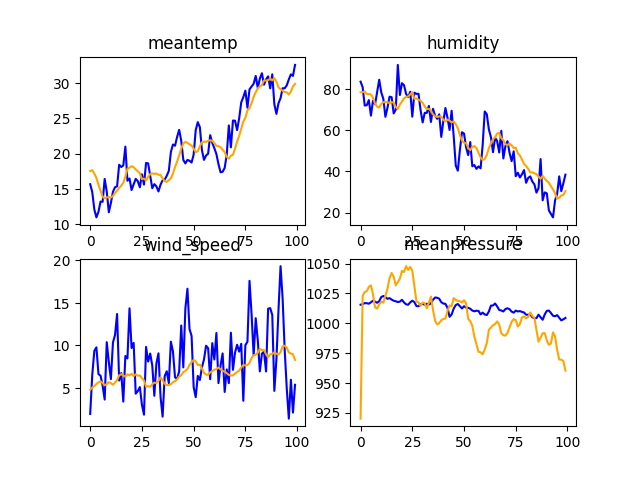

## Introduction
+ <b>daily_climate_time_series</b> is the task of predicting the next day climate based on history data. To this the problem, I built a simple model 
but effective only with 40 weights.
+ The Dataset is fully dedicated for the developers who want to train the model on Weather Forecasting for Indian climate. This dataset provides 
data from 1st January 2013 to 24th April 2017 in the city of Delhi, India. The 4 parameters here are meantemp, humidity, wind_speed, meanpressure.

### Demo

    
